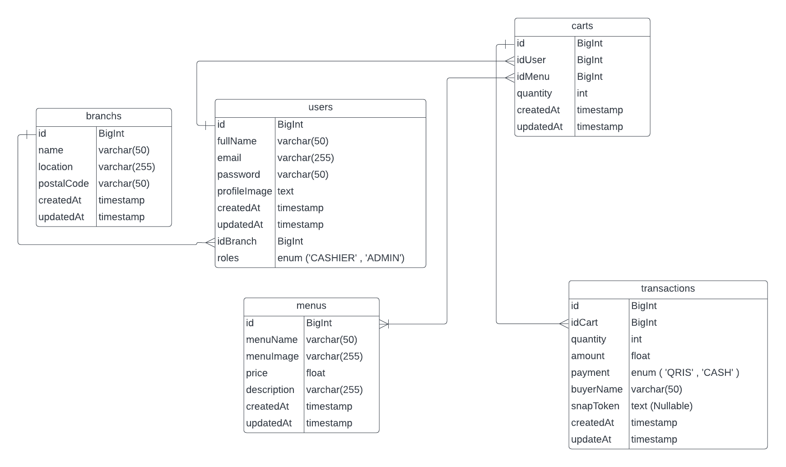
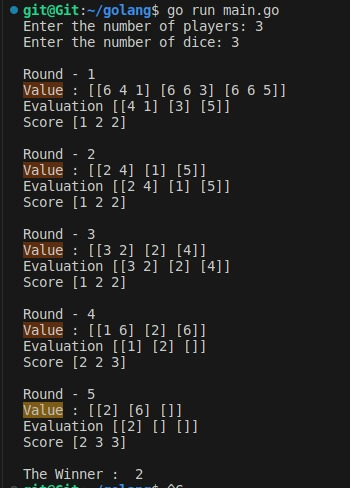

# QoinDigital
Qoin 

#### ERD (Entity Relationship Diagram)

#### Requirement
    1. Bagian Cashier bisa menambahkan menu yang di pesan Pelanggan.
    2. bisa cetak struk pembelian.
    3. laporan penghasilan bisa harian / mingguan / bulanan.
    4. dapat mengetahui stock menu yang tersedia.
    5. payment berbentuk qris / cash.
    6. dapat melakukan CRUD dengan role user = 1 (Admin).
    7. terdapat authenticate dan authorization untuk Cashier dan Admin.

#### Techstack
    Aplikasi ini akan saya buat menggunakan untuk bagian frontend Flutter sehingga dapat dibuild secara multi-platform (Mobile / Web / Desktop) dan 
    menggunakan golang untuk backend nya

#### 1. Frontend menggunakan Flutter:
    **Pengembangan Cross-platform:** Flutter memungkinkan pengembangan aplikasi cross-platform yang dapat dijalankan di iOS, Android, dan web dengan menggunakan satu basis kode. Ini mengurangi overhead pengembangan dan memungkinkan Anda mencapai lebih banyak pengguna dengan kode yang lebih sedikit.
    **Performa Tinggi:** Flutter menggunakan mesin rendering sendiri yang disebut Skia, yang memberikan performa tinggi dan antarmuka pengguna yang responsif.
    **Widget Framework:** Flutter menggunakan konsep widget yang kaya, yang mempermudah pembangunan antarmuka pengguna yang dinamis dan menarik.

#### 2. Backend menggunakan Golang (dengan framework Echo):
    **Kinerja Tinggi:** Golang dirancang untuk memberikan kinerja tinggi. cocok untuk aplikasi yang membutuhkan kinerja tinggi, seperti aplikasi web real-time.
    **Mudah Dikelola:** Golang memiliki sintaks yang sederhana dan jelas. Ini memungkinkan pengembangan dan pemeliharaan kode yang lebih mudah.

#### 3. Database MySQL
    **Kompatibilitas:** MySQL umumnya kompatibel dengan banyak bahasa pemrograman dan kerangka kerja pengembangan. Ini memudahkan integrasi dengan berbagai aplikasi dan teknologi.

#### Run
    go run main.go

#### Result    

